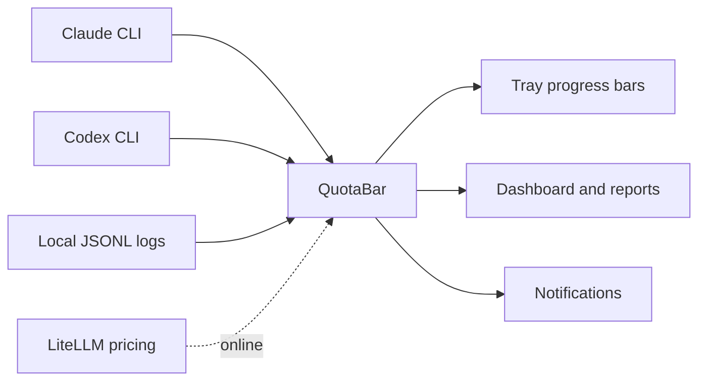

<p align="center">
  
</p>

<h1 align="center">QuotaBar for Windows</h1>

<p align="center">
  A Windows tray app for monitoring AI coding quota usage and local API-equivalent costs for Claude and Codex.
</p>

<p align="center">
  <a href="#requirements"></a>
  <a href="https://www.electronjs.org/"></a>
  <a href="https://www.typescriptlang.org/"></a>
  <a href="https://vitest.dev/"></a>
  <a href="#license"></a>
</p>

<p align="center">
  <a href="#quick-start">Quick Start</a>
  &middot;
  <a href="#provider-data">Provider Data</a>
  &middot;
  <a href="#cost-tracking">Cost Tracking</a>
  &middot;
  <a href="#development">Development</a>
  &middot;
  <a href="#security-and-privacy">Security</a>
</p>

QuotaBar runs quietly in the Windows system tray, reads credentials and usage logs from known local CLI locations, and keeps quota windows, usage history, cost analytics, and reset notifications one click away.

> QuotaBar does not scan your disk for credentials. It reads only known provider paths and redacts sensitive values before logging.

## Highlights

| Tray-first monitoring | Usage analytics | Privacy-aware by design |
| --- | --- | --- |
| Stacked per-provider progress bars in the Windows tray. | Daily, weekly, monthly, and session-level reports. | Known-path credential reads only, with redacted logs. |
| 5-hour and weekly quota windows where provider data is available. | API-equivalent USD costs, token totals, cache usage, and subscription factor. | Unofficial provider endpoints are isolated and handled defensively. |

## How It Works



## Requirements

- Windows
- Node.js and npm
- Claude CLI login, Codex CLI login, or both
- Local provider usage logs for historical cost and report data

QuotaBar is an early Windows MVP. Provider quota data depends on unofficial endpoints that may change without notice; the app handles failures defensively and keeps stale data visible when live refreshes fail.

## Quick Start

```powershell
npm install
npm run build
npm run dev
```

To create Windows installer and portable artifacts:

```powershell
npm run package
```

Build output is written to `dist/`; packaged artifacts are written to `package-output/`.

## Authentication

Sign in with the local CLI tools first:

```powershell
claude login
codex login
```

QuotaBar reads credentials only from known provider paths:

| Provider | Credential path |
| --- | --- |
|  Claude | `~/.claude/.credentials.json` |
|  Codex | `${CODEX_HOME:-~/.codex}/auth.json` |

`CLAUDE_CONFIG_DIR` and `CODEX_HOME` may contain comma-separated roots. QuotaBar deduplicates existing roots and combines usage data from them.

## Provider Data

| Provider | Live quota source | Historical cost/report source |
| --- | --- | --- |
|  Claude | `~/.claude/.credentials.json` plus OAuth usage endpoint | `~/.config/claude/projects/**/*.jsonl`, `~/.claude/projects/**/*.jsonl` |
|  Codex | `${CODEX_HOME:-~/.codex}/auth.json` plus usage endpoint | `${CODEX_HOME:-~/.codex}/sessions/**/*.jsonl` |

Claude and Codex quota windows are fetched through unofficial provider endpoints. Those integrations are isolated in provider/auth modules and are treated as best-effort data sources.

## Dashboard And Reports

| Capability | Details |
| --- | --- |
| Provider filtering | All providers, Claude, or Codex |
| Report types | Daily, weekly, monthly, and session-level reports |
| Report controls | Since/until filters, timezone selection, project/instance filtering, sort order, and instance grouping |
| Claude cost modes | `auto`, `calculate`, `display` |
| Codex speed modes | `auto`, `standard`, `fast` |
| Export | Copyable JSON output for programmatic analysis |

Weekly reports use Monday as the week start. JSON field names are stable English names.

## Cost Tracking

QuotaBar reads local JSONL logs, fetches current model pricing from LiteLLM when online, and calculates API-equivalent costs in USD.

```text
subscription factor = API cost (USD) / (subscription cost (USD) x window_days / 30)
```

The factor is normalized to the selected cost window, so windows remain comparable. `1x` means API-equivalent cost matches the subscription cost for that period. `10x` means API-equivalent cost is ten times the subscription cost.

| Cost setting | Supported values |
| --- | --- |
| Claude cost mode | `auto`, `calculate`, `display` |
| Codex speed mode | `auto`, `standard`, `fast` |
| Cost window | `7d`, `30d`, `all` |
| Pricing mode | Online LiteLLM pricing or offline mode |

Claude cost modes:

| Mode | Behavior |
| --- | --- |
| `auto` | Use `costUSD` from logs when present; calculate missing entries from tokens |
| `calculate` | Calculate all entries from tokens and current pricing |
| `display` | Show only `costUSD` values already present in logs |

Codex cached input uses cache-read pricing when available and falls back to input pricing when a model lacks a cache-read price.

Settings are stored in `%APPDATA%\quotabar-win\settings.json`:

```jsonc
{
  "subscriptionCosts": {
    "claude": 20,
    "codex": 20
  },
  "pricingOfflineMode": false,
  "costWindow": "30d"
}
```

Older settings files may contain extra provider keys. QuotaBar ignores unsupported providers and writes only supported providers on save.

For the full calculation model, see [docs/how-quotabar-calculates.md](docs/how-quotabar-calculates.md).

## Development

| Command | Purpose |
| --- | --- |
| `npm run dev` | Build and start Electron in debug mode |
| `npm run build` | Compile TypeScript into `dist/` |
| `npm test` | Run the Vitest test suite |
| `npm run package` | Build Windows installer and portable artifacts |

## Project Structure

```text
src/
|- main/       Electron lifecycle, tray menu, dashboard, notifications, autostart
|- providers/  Claude and Codex live usage providers
|- auth/       Credential parsing, JWT helpers, token refresh
|- usage/      Refresh loop, snapshot store, reset detection, formatters, pace
|- pricing/    JSONL readers, cost calculators, LiteLLM fetcher, subscription factor
|- reports/    Daily, weekly, monthly, and session report aggregation
|- icon/       Tray icon progress bars
|- config/     Paths, settings, first-run prompt
`- shared/     Redaction and shared error types
```

## Security And Privacy

| Protection | Implementation |
| --- | --- |
| Credential scope | Credentials are read only from known provider paths |
| Log safety | Tokens, cookies, authorization headers, and JWTs are redacted before logging |
| Disk access | QuotaBar does not scan the disk for auth files |
| Provider isolation | Unofficial endpoints are kept inside provider/auth modules and handled defensively |

## Status

QuotaBar is under active development as a Windows-first MVP. Cost tracking requires local JSONL logs. LiteLLM pricing refreshes require network access unless `pricingOfflineMode` is enabled.

## License

MIT
