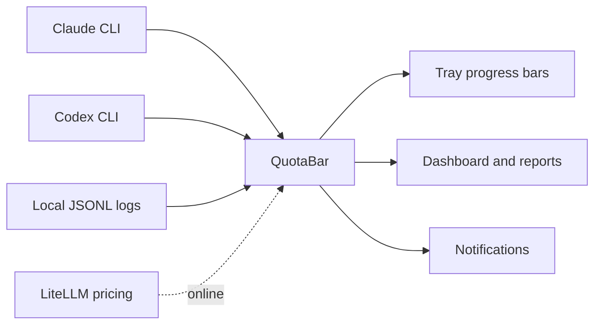
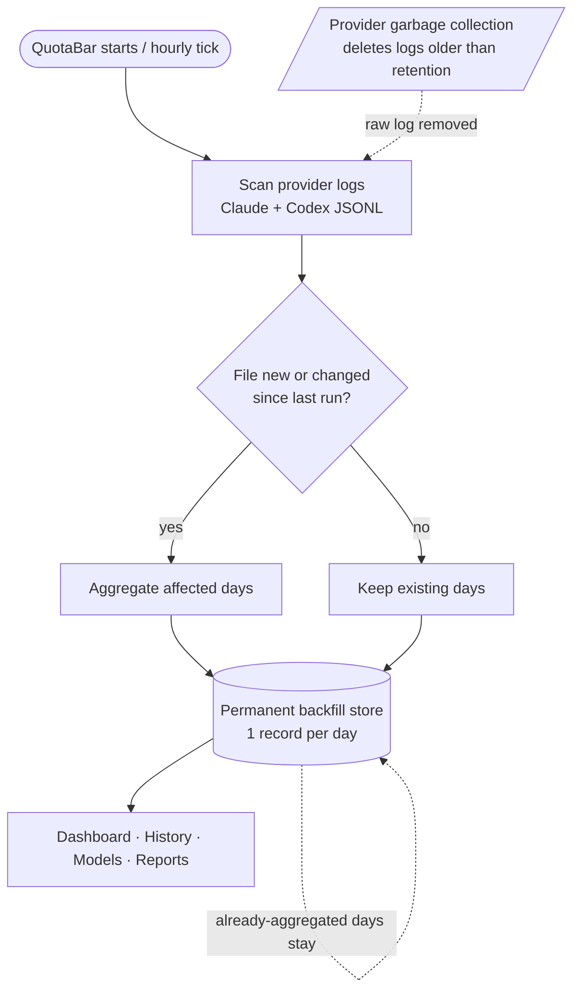

<p align="center">
  
</p>

<h1 align="center">QuotaBar for Windows</h1>

<p align="center">
  Know your AI spend at a glance — quota progress bars, API-equivalent costs, and usage history for Claude and Codex, right in the Windows tray.
</p>

<p align="center">
  <a href="#requirements"></a>
  <a href="https://www.electronjs.org/"></a>
  <a href="https://www.typescriptlang.org/"></a>
  <a href="https://vitest.dev/"></a>
  <a href="#license"></a>
</p>

<p align="center">
  <a href="#quick-start">Quick Start</a>
  &middot;
  <a href="#provider-data">Provider Data</a>
  &middot;
  <a href="#data-lifecycle">Data Lifecycle</a>
  &middot;
  <a href="#dashboard-and-reports">Dashboard</a>
  &middot;
  <a href="#models-tab">Models</a>
  &middot;
  <a href="#cost-tracking">Cost Tracking</a>
  &middot;
  <a href="#development">Development</a>
  &middot;
  <a href="#security-and-privacy">Security</a>
</p>

QuotaBar sits in the Windows system tray, reads credentials and usage logs from known local CLI paths, and surfaces quota windows, cost analytics, usage history, and reset notifications without leaving your workflow.

> QuotaBar does not scan your disk for credentials. It reads only known provider paths and redacts sensitive values before logging.

## Highlights

| Tray-first monitoring | Usage analytics | Privacy-aware by design |
| --- | --- | --- |
| Stacked per-provider progress bars in the Windows tray. | Daily, weekly, monthly, and session-level reports. | Credentials read only from known provider paths; sensitive values redacted from logs. |
| 5-hour and weekly quota windows where provider data is available. | API-equivalent USD costs, token totals, cache usage, and subscription factor. | Unofficial provider endpoints are isolated and handled defensively. |
| | Per-model breakdown: cost share, cache efficiency, adoption timeline, and price/intelligence scatter. | |

## How It Works



## Requirements

- Windows
- Node.js and npm
- Claude CLI login, Codex CLI login, or both
- Local provider usage logs for historical cost and report data

> **Early MVP:** Provider quota data depends on unofficial endpoints that may change without notice. QuotaBar handles failures defensively and keeps stale data visible when live refreshes fail.

## Quick Start

```powershell
npm install
npm run build
npm run dev          # Electron opens with a tray icon in the system tray
```

To create a Windows installer and portable artifacts:

```powershell
npm run package      # Output written to package-output/
```

Build output (compiled JS) is written to `dist/`.

## Authentication

Sign in with the local CLI tools first:

```powershell
claude login
codex login
```

QuotaBar reads credentials only from known provider paths:

| Provider | Credential path |
| --- | --- |
|  Claude | `~/.claude/.credentials.json` |
|  Codex | `${CODEX_HOME:-~/.codex}/auth.json` |

`CLAUDE_CONFIG_DIR` and `CODEX_HOME` may contain comma-separated roots. QuotaBar deduplicates existing roots and combines usage data from them.

## Provider Data

| Provider | Live quota source | Historical cost/report source |
| --- | --- | --- |
|  Claude | `~/.claude/.credentials.json` plus OAuth usage endpoint | `~/.config/claude/projects/**/*.jsonl`, `~/.claude/projects/**/*.jsonl` |
|  Codex | `${CODEX_HOME:-~/.codex}/auth.json` plus usage endpoint | `${CODEX_HOME:-~/.codex}/sessions/**/*.jsonl` |

Claude and Codex quota windows are fetched through unofficial provider endpoints. Those integrations are isolated in provider/auth modules and are treated as best-effort data sources.

> **⚠️ Providers delete their usage logs over time.** QuotaBar can only see logs a provider still keeps on disk. **Claude** removes session transcripts older than `cleanupPeriodDays` (**default: 30 days**) — raise it in `~/.claude/settings.json` (e.g. `{ "cleanupPeriodDays": 1095 }` for ~3 years) to keep more. **Codex** currently keeps all sessions, but the same rules apply if that ever changes. See [Data Lifecycle](#data-lifecycle) for how QuotaBar makes history permanent despite this.

## Data Lifecycle

Providers (Claude, Codex) write raw usage logs locally and **delete them after a while** (Claude: 30 days by default). QuotaBar reads those logs once, aggregates each day into its own **permanent backfill store** (`%APPDATA%\quotabar-win\debug\<date>.backfill.jsonl`), and serves the dashboard from there. A day that has been aggregated survives even after the provider deletes the original log.



What this means in practice:

| Scenario | What happens |
| --- | --- |
| **First start** | QuotaBar imports everything the provider *still has on disk*. With Claude's 30-day default, that's only the last ~30 days — anything older was already deleted by the provider and **cannot be recovered**. |
| **Daily use** | On each start/tick QuotaBar checks only new or changed log files and writes any missing days into the permanent store. Cheap and incremental. |
| **A few days without QuotaBar** | On the next start, backfill automatically catches up **all missed days** — as long as the provider hasn't deleted those logs yet (i.e. you're back within the retention window). |
| **Provider deletes old logs (GC)** | Days already aggregated into the backfill store stay intact. Only days that were *never* aggregated — because QuotaBar didn't run during the whole retention window — are lost for good. |

> **Takeaway:** Run QuotaBar regularly and history grows permanently. The only way to lose data is leaving QuotaBar off longer than the provider's retention window. Raising `cleanupPeriodDays` widens that safety margin.

## History Tab

The History tab shows per-period cost and token breakdowns served from the permanent backfill store.

| Capability | Details |
| --- | --- |
| Resolution | Hourly · Daily · Weekly · Monthly |
| Date range | Preset ranges (Last 7 d, 30 d, this week / month / year, all time) or custom since / until |
| Provider filter | All · Claude · Codex |
| Chart toggle | Switch between USD costs and token volumes (total, input, output, or cache) |
| Summary KPIs | Total API cost, per-provider split, total tokens |
| Table | Per-period rows with cost and all token-type columns |

Weekly buckets start on Monday.

## Models Tab

The Models tab breaks down token and cost data by individual model across your full history, combining backfill day records with live JSONL data.

### KPI tiles

| Tile | Description |
| --- | --- |
| Ø $/MTok effective | Total cost ÷ total tokens (all token types included), with period-over-period delta |
| Active models | Number of distinct models used in the selected window |
| Top by cost | Model with the highest USD spend and its share of total cost |
| Top by output | Model with the most output tokens |
| Price/performance | Model with the best benchmark score per dollar (requires benchmark data) |
| Top-3 share | Cost concentration: combined share of the three most expensive models |

### Model distribution chart

100% stacked bar chart showing the relative share of each model over time. Controls:

| Control | Options |
| --- | --- |
| Time window | 30D · 90D · All (ISO-week buckets for "All") |
| Metric | Output · Input · Cache Read · Cache Creation · Total tokens · Cost |
| Provider filter | All · Claude · Codex |

The provider ribbon below the chart shows the Claude/Codex split per bucket at a glance.

### Price vs. intelligence scatter

Visible when benchmark data is present (`src/config/model-benchmarks.json`). Each model is plotted with effective $/MTok on the x-axis and the Artificial Analysis Intelligence Index score on the y-axis. Bubble size encodes cost share. Good-value models appear in the upper-left quadrant.

### Model detail table

Sortable table with one row per model. Columns: Input, Output, Cache Read, Cache Creation, Total tokens, Cost (USD), Effective $/MTok, Benchmark score, Score/$, Cost share %, Cache-hit rate, First used, Last used. Click any column header to sort.

### Model adoption timeline

Heatmap by month showing when each model was introduced and how its usage evolved. Cell opacity scales with output token volume relative to the model's peak month.

### Cache efficiency panel

Per-model cache-hit rate bar and estimated USD saved through cache reads (requires LiteLLM pricing data).

---

## Analytics Tab

The Analytics tab shows longer-term patterns across the full history.

| Section | Details |
| --- | --- |
| Cost / ROI trend | Multi-series line chart (Claude + Codex) aggregated by hour, day, week, or month |
| Usage breakdown | Donut chart with per-provider cost share and combined ROI factor for the selected window |
| Top models by cost | Ranked table with cost and percentage share |
| Activity stats | Session count, active days, tokens per day, and other aggregate KPIs |
| Hour heatmap | 24-hour grid showing when usage is concentrated |
| Weekday pattern | Per-weekday bar chart and top-5 most expensive days |
| 5h window peak | Highest single 5-hour window within the selected range |
| Cost efficiency | Per-model cache-hit rates and estimated USD saved |
| ROI by subscription tier | Subscription factor broken out by plan tier |
| 5h window history | Rolling utilisation chart over time (requires debug logging) |

The **ROI factor** is `API cost ÷ (subscription cost × window_days / 30)` — normalised so any window length is directly comparable to a monthly subscription price.

## Notifications

QuotaBar fires Windows toast notifications for quota and cost events. Rules are configured individually with enable/disable toggles, cooldown durations, and global quiet hours.

| Category | Rules |
| --- | --- |
| Quota window | Confirmed reset, unexpected reset, reset approaching, high / critical usage |
| Pace & forecast | Projected depletion, burning too fast, burning too slow |
| Historical usage | Fresh quota, quota idle, weekly reserve low, output spike, burn-rate spike |
| Cost efficiency | Cache-hit rate drop, expensive model spike, ROI milestone |
| Data quality | Provider data stale / restored |

All fired notifications are stored in the **Notifications** tab history with timestamps and full details.

## Cost Tracking

QuotaBar reads local JSONL logs, fetches current model pricing from LiteLLM when online, and calculates API-equivalent costs in USD.

```text
subscription factor = API cost (USD) / (subscription cost (USD) × window_days / 30)
```

The factor is normalized to the selected cost window, so windows remain comparable. `1x` means API-equivalent cost matches the subscription cost for that period. `10x` means API-equivalent cost is ten times the subscription cost.

Token details (input, output, cache creation, cache read, total) are shown per provider in the live view, scoped to the active cost window. The window label is visible directly in the Token Details toggle (e.g. `Token Details · 30d`).

| Cost setting | Supported values |
| --- | --- |
| Claude cost mode | `auto`, `calculate`, `display` |
| Codex speed mode | `auto`, `standard`, `fast` |
| Cost window | `7d`, `30d`, `all` |
| Pricing mode | Online LiteLLM pricing or offline mode |

Claude cost modes:

| Mode | Behavior |
| --- | --- |
| `auto` | Use `costUSD` from logs when present; calculate missing entries from tokens |
| `calculate` | Calculate all entries from tokens and current pricing |
| `display` | Show only `costUSD` values already present in logs |

For Claude, all four token types contribute to cost: input (uncached), output, cache creation, and cache read — each at their own per-token price. For Codex, cached and uncached input are billed separately (cache-read pricing where available, input pricing as fallback).

For the full calculation model, see [docs/how-quotabar-calculates.md](docs/how-quotabar-calculates.md).

Settings are stored in `%USERPROFILE%\.quotabar-win\settings.json`:

```jsonc
{
  "subscriptionCosts": {
    "claude": 20,
    "codex": 20
  },
  "pricingOfflineMode": false,
  "costWindow": "30d"
}
```

Older settings files may contain extra provider keys. QuotaBar ignores unsupported providers and writes only supported providers on save.

## Development

### Setup

```powershell
npm install
```

### Commands

| Command | Purpose |
| --- | --- |
| `npm run dev:watch` | **Recommended for development** — TypeScript recompiles automatically on save, Electron restarts on changes |
| `npm run dev` | One-shot: build once and start Electron |
| `npm run build` | Compile TypeScript into `dist/` (required before running after TS changes) |
| `npm test` | Run the Vitest test suite |
| `npm run package` | Build Windows installer and portable artifacts into `package-output/` |

### What needs a restart?

| Changed file | What to do |
| --- | --- |
| `src/renderer/**` (UI, HTML, CSS) | In the open window: **Ctrl+Shift+I** → `location.reload()` — no restart needed |
| `src/main/**`, `src/pricing/**`, `src/reports/**` (TypeScript) | `npm run build` or use `npm run dev:watch` (auto-restarts) |

### Development workflow

`npm run dev:watch` is the fastest inner loop: it runs `tsc --watch` and `nodemon` in parallel. TypeScript compiles on every save; Electron restarts automatically ~2 seconds after a `.ts` change. For renderer-only changes, skip the restart entirely with `location.reload()` in DevTools.

## Project Structure

```text
src/
|- main/       Electron lifecycle, tray menu, notifications, autostart, backfill
|              └─ modelsData.ts  per-model aggregation (backfill + live-tail merge)
|- providers/  Claude and Codex live usage providers
|- auth/       Credential parsing, JWT helpers, token refresh
|- usage/      Refresh loop, snapshot store, reset detection, bonus detection, pace
|- pricing/    JSONL readers, cost calculators, LiteLLM fetcher, subscription factor
|- reports/    Hourly, daily, weekly, monthly, and session report aggregation
|- config/     Paths, settings, first-run prompt
|              └─ model-benchmarks.json  static Artificial Analysis Intelligence Index scores
|- icon/       Tray icon progress bars
`- shared/     Redaction, shared error types, model name normalisation
renderer/tabs/
|- live.js             Live quota view
|- history.js          History tab UI
|- models-calc.js      Pure calc helpers (UMD — runs in browser and Vitest)
|- models.js           Models tab UI
|- analytics.js        Analytics tab UI
|- plans.js            Subscriptions tab UI
|- notifications.js    Notifications tab UI
`- system.js           System / data management tab UI
```

## Security and Privacy

| Protection | Implementation |
| --- | --- |
| Credential scope | Credentials are read only from known provider paths |
| Log safety | Tokens, cookies, authorization headers, and JWTs are redacted before logging |
| Disk access | QuotaBar does not scan the disk for auth files |
| Provider isolation | Unofficial endpoints are kept inside provider/auth modules and handled defensively |

## Release & Auto-Update

Installed builds update automatically via GitHub Releases.

### Publishing a release

```powershell
git checkout main
git pull
npm version patch        # bumps package.json, creates commit + tag vX.Y.Z
git push --follow-tags   # triggers the release workflow
```

Use `npm version minor` or `npm version major` for larger bumps.

The GitHub Action (`release.yml`) runs on `windows-latest`, builds the NSIS installer, and publishes it directly as a GitHub Release (not a draft) together with `latest.yml`.

Installed clients check for updates on startup and every 6 hours. An available update is downloaded silently and installed on the next app exit. The tray menu also shows "Update ready — restart now" when an update is waiting.

### Developing alongside the installed build

The installed build and `npm run dev` share the same data directory (`%USERPROFILE%\.quotabar-win\`) and the same single-instance lock. Therefore:

- **Before `npm run dev`:** Exit the installed build from the tray (right-click → Exit).
- **Then:** Start the dev instance as usual.

Both instances cannot run at the same time.

### SmartScreen

Builds are not code-signed. On first launch Windows may show "Windows protected your PC" → "More info" → "Run anyway".

## License

MIT
