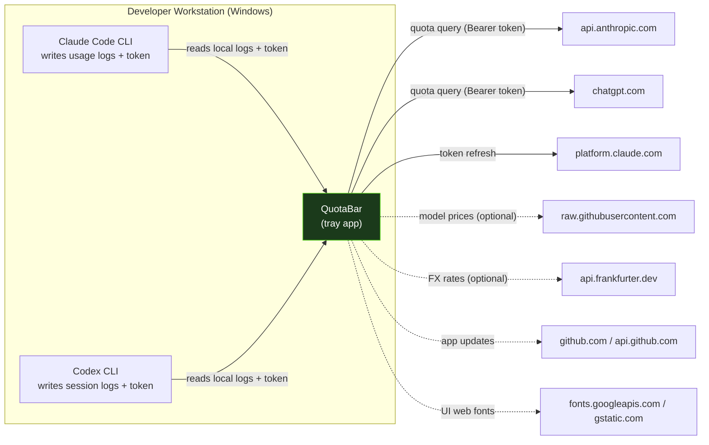
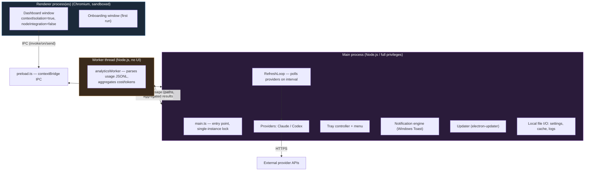
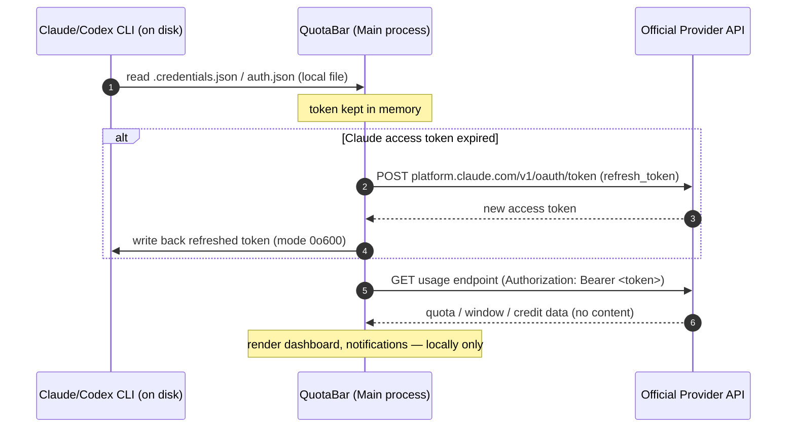
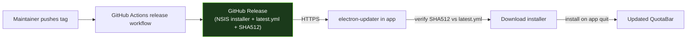
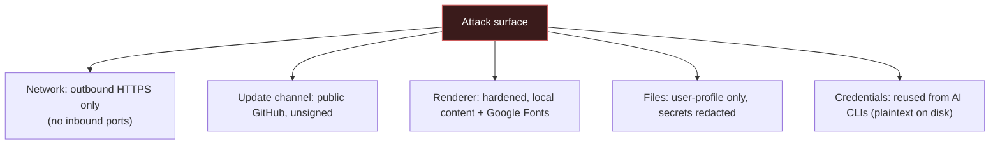

# QuotaBar — Technical IT Security Concept

**For enterprise deployment review and approval**

| Field | Value |
|---|---|
| Document title | Technical IT Security Concept — QuotaBar for Windows |
| Product | QuotaBar for Windows |
| Product version assessed | 1.0.2 |
| Application type | Local Electron desktop tray application (single user, no server backend) |
| Vendor / source | Open source, MIT License — GitHub `spiral023/QuotaBar` |
| Document version | 1.0 |
| Date | 2026-06-23 |
| Author | Philipp Asanger |
| Classification | Internal |
| Status | Draft for IT Security review |
| Reviewer / Approver | _[to be completed by IT Security]_ |

> This document is a security architecture description intended to support an
> enterprise installation approval. It is based on a direct review of the
> QuotaBar source code (version 1.0.2). File and line references are provided so
> that every statement can be independently verified.

---

## 1. Executive Summary

QuotaBar is a **local, single-user Windows desktop application** (Electron tray
app) that visualizes the **quota and cost usage of AI coding assistants** —
specifically Anthropic **Claude Code** and OpenAI **Codex/ChatGPT**. It reads
usage telemetry that those tools already store locally on the developer's
machine, queries the official provider quota endpoints to display remaining
allowances, and renders charts and notifications in a tray-based dashboard.

Key security characteristics:

- **No vendor telemetry.** QuotaBar sends **no analytics, usage data, prompts,
  or source code to its own developers or to any third party**. There is no
  QuotaBar backend server.
- **No content access.** It reads only **metadata** (token counts, model names,
  timestamps, computed cost). It does **not** read or transmit prompt text or
  user source code.
- **Reuses existing credentials.** It does not create new credentials. It reads
  the OAuth tokens that the Claude Code CLI and Codex CLI already place on disk,
  and uses them only to call the **official provider endpoints**
  (`api.anthropic.com`, `chatgpt.com`).
- **Local-only data storage.** All application data (settings, caches, logs) is
  stored locally under the user profile. Secrets are redacted from logs.
- **Hardened renderer.** `contextIsolation` is enabled and `nodeIntegration` is
  disabled in all windows.

Residual items that an enterprise should weigh and, where appropriate, mitigate
through deployment policy (detailed in sections 9–12):

1. The application binary is **not Authenticode code-signed** by the vendor.
2. **Auto-update** pulls from the public GitHub release of the open-source
   project and is enabled by default (download + install-on-quit).
3. The UI **loads web fonts from Google Fonts** (`fonts.googleapis.com`),
   creating an outbound connection to Google and a GDPR-relevant data flow (IP
   address).
4. The IPC preload bridge is a **generic pass-through** without an explicit
   channel allow-list (defense-in-depth gap, low real-world exposure because the
   renderer loads only local, bundled content).

None of these are remote-exploitable by default, but each is addressable through
the hardening recommendations in section 12.

---

## 2. Purpose and Scope

### 2.1 Purpose

To provide the organisation's IT Security function with the technical
information required to assess and approve the installation of QuotaBar on
managed company workstations.

### 2.2 In scope

- The QuotaBar Windows desktop application, version 1.0.2.
- Its local file access, network communication, credential handling, update
  mechanism, and process/runtime architecture.

### 2.3 Out of scope

- The security of the AI coding tools whose data QuotaBar reads (Claude Code,
  Codex CLI) — these are assumed to be already approved and installed.
- The security of the upstream AI provider APIs themselves.
- macOS/Linux builds (the assessed build targets Windows / NSIS only).

---

## 3. System Overview

QuotaBar is a tray-resident helper that answers a single question for a
developer: *"How much of my AI coding quota / budget have I used, and when does
it reset?"*

**Legend:** solid arrows = core function (only fired for the providers actually
in use); dotted arrows = auxiliary/optional or UI-related traffic.

The application has **no server component**. There is no central database, no
account system operated by the vendor, and no inbound network listener.

---

## 4. Architecture and Trust Boundaries

### 4.1 Process model

QuotaBar follows the standard hardened Electron multi-process model.

### 4.2 Trust boundaries

| Boundary | Description | Control |
|---|---|---|
| Renderer ↔ Main | UI code cannot touch Node/OS directly | `contextIsolation: true`, `nodeIntegration: false`, all privileged work behind IPC (`src/main/detailsWindow.ts`, `src/main/onboardingWindow.ts`, `src/main/preload.ts`) |
| Worker ↔ Main | Analytics parsing isolated in a worker thread | `worker_threads`, message-passing only (`src/main/analyticsWorker.ts`, `src/main/workerClient.ts`) |
| App ↔ External APIs | Outbound HTTPS only, no inbound listener | TLS via Node/Electron stack |
| App ↔ Provider credentials | Credentials owned by the AI CLIs, reused read-only (refresh writes back to Claude file) | `src/auth/*` |

### 4.3 Renderer hardening (verified)

| Setting | Value | Reference |
|---|---|---|
| `contextIsolation` | `true` | `src/main/detailsWindow.ts`, `src/main/onboardingWindow.ts` |
| `nodeIntegration` | `false` | same |
| `sandbox` | not explicitly set → **Electron default (enabled since Electron 20)** applies; the preload only uses `contextBridge`/`ipcRenderer`, which are sandbox-compatible | preload uses no Node built-ins |
| Preload bridge | `contextBridge.exposeInMainWorld("__QB_IPC_BRIDGE__", …)` | `src/main/preload.ts` |
| Remote content | Renderer HTML/JS is **bundled locally**; chart.js is bundled (no CDN). Only web fonts are remote. | `src/renderer/**` |

---

## 5. Data Processing and Classification

### 5.1 Data categories handled

| # | Data | Classification | Source | Leaves the machine? |
|---|---|---|---|---|
| D1 | OAuth access/refresh tokens (Claude, Codex) | **Secret / highly sensitive** | `~/.claude/.credentials.json`, `~/.codex/auth.json` | Only to the **official provider** (Bearer header / refresh request). Never to vendor or third parties. |
| D2 | Account e-mail + account UUID | **Personal data (PII)** | Claude profile API / Codex `id_token` (JWT) | Retrieved from the provider; held in memory/cache; **redacted** in logs |
| D3 | Usage metadata: token counts, model names, timestamps, session IDs, computed cost | Internal / low sensitivity | Local JSONL usage logs of the AI CLIs | No (used locally for charts/cost) |
| D4 | App settings, caches, notification history | Internal / low sensitivity | Generated by QuotaBar | No |

### 5.2 What QuotaBar explicitly does **not** process

- **No prompt text.** The JSONL readers extract only `usage` token figures,
  model id, and timestamps — not message bodies
  (`src/pricing/jsonl-reader.ts`, `src/pricing/codex-log-reader.ts`).
- **No source code.** No file content of the developer's projects is read.
- **No keystrokes, screen capture, or clipboard scraping.** (The clipboard is
  only *written* to, on explicit "copy JSON" user actions.)

### 5.3 Data flow for credentials and quota (sequence)

### 5.4 GDPR / data protection note

- The only **personal data** processed is the developer's own AI-account
  **e-mail address and account ID** (D2), processed **locally** for display.
  It is **redacted from all log files** (`src/shared/redaction.ts`).
- One **outbound personal-data flow to a third party exists by default**:
  loading **Google Fonts** transmits the workstation's **IP address to Google**
  (`fonts.googleapis.com` / `fonts.gstatic.com`,
  `src/renderer/index.html`). In an EU/Austrian context this is the same
  category of flow that has been challenged under GDPR for web Google Fonts
  usage. **Recommendation: self-host the fonts** (see section 12) to remove the
  flow entirely.

---

## 6. Network Communication

All outbound traffic is **HTTPS (TLS)**. The application opens **no inbound
listening ports**. There is **no peer-to-peer or LAN communication**.

### 6.1 Endpoint inventory (firewall / proxy allow-list)

| Endpoint | Purpose | Triggered when | Auth / data sent | Frequency | Reference |
|---|---|---|---|---|---|
| `api.anthropic.com` | Claude quota + profile | Claude provider enabled | `Bearer` access token (Claude); header only, no content | Poll interval (default ~60s) | `src/providers/claude.ts`, `src/auth/claudeProfile.ts` |
| `platform.claude.com` | Claude OAuth token refresh | Claude token expired | refresh token + public client id | On expiry | `src/auth/tokenRefresh.ts` |
| `chatgpt.com` | Codex/ChatGPT quota | Codex provider enabled | `Bearer` access token (Codex) + account id header | Poll interval (default ~60s) | `src/providers/codex.ts` |
| `raw.githubusercontent.com` | Model price table (LiteLLM) | Cost features, online mode | None | ~once per process, cached | `src/pricing/litellm-fetcher.ts` |
| `api.frankfurter.dev` | EUR/USD FX rate | Cost in non-USD, online mode | None | On demand, cached | `src/pricing/fx-fetcher.ts` |
| `github.com` / `api.github.com` / `objects.githubusercontent.com` | App auto-update feed + artifacts | Auto-update enabled | None (public repo); app version compared locally | First check ~20s after start, then every 6h | `src/main/updater.ts`, `electron-builder.yml` |
| `fonts.googleapis.com` / `fonts.gstatic.com` | UI web fonts | Dashboard/onboarding window opened | None except request (IP address) | On window open | `src/renderer/index.html`, `src/renderer/onboarding.html` |

> **Note on tokens:** Bearer tokens are sent **only to the provider that issued
> them** (Anthropic token → Anthropic; Codex token → ChatGPT backend). Tokens
> are never sent to QuotaBar, GitHub, Google, Frankfurter, or LiteLLM.

### 6.2 Reducing the network footprint

- The **price and FX fetchers have an offline mode** and fall back to built-in
  values; cost features still work without `raw.githubusercontent.com` and
  `api.frankfurter.dev` (`src/pricing/litellm-fetcher.ts`,
  `src/pricing/fx-fetcher.ts`).
- **Auto-update can be disabled** for managed deployments (section 12).
- **Google Fonts can be removed** by self-hosting (section 12).
- The **provider endpoints** are the only ones strictly required for the core
  function, and only for the provider(s) actually in use.

### 6.3 Minimal allow-list

For a Claude-only deployment with auto-update disabled and fonts self-hosted,
the **only required egress** is:

- `api.anthropic.com`
- `platform.claude.com`

For Codex, add `chatgpt.com`.

---

## 7. Local Data Storage and File System Access

### 7.1 Files read from the system

| Path (Windows) | Content read | Notes |
|---|---|---|
| `%USERPROFILE%\.claude\.credentials.json` | Claude OAuth access/refresh token, scopes, tier | Owned by Claude Code CLI; refreshed token written back |
| `%USERPROFILE%\.codex\auth.json` | Codex access token, id_token (JWT → e-mail, account id) | Owned by Codex CLI; read only |
| `%USERPROFILE%\.claude\projects\**\*.jsonl` | Token counts, model, timestamps | **No prompt text** |
| `%USERPROFILE%\.codex\sessions\**\*.jsonl` | Token usage events, model | **No prompt text** |
| `%USERPROFILE%\.codex\config.toml` | `service_tier` value only | For cost tier calculation |

Configurable overrides are honoured (`CLAUDE_CONFIG_DIR`, `CODEX_HOME`,
`QUOTABAR_CLAUDE_OAUTH_TOKEN`) — see `src/config/paths.ts`, `src/auth/*`.

### 7.2 Files written by QuotaBar

All under `%USERPROFILE%\.quotabar-win\` (`src/config/paths.ts`):

| File / dir | Purpose | Sensitive content |
|---|---|---|
| `quotabar.log` | Application log | Secrets **redacted** (`src/main/logging.ts`, `src/shared/redaction.ts`) |
| `notifications.log` | Notification history (JSONL, size-capped) | Rule/severity metadata only |
| `settings.json` | User settings | No credentials |
| `cache/usage-snapshots.json` | Last quota snapshots | Public API response data only; **no tokens** |
| `cache/fx-rates.json` | Cached FX rates | None |
| `window-ratio.json`, `bonus-state.json`, `window-history.json`, `notification-state.json` | Internal state | None sensitive |
| `debug/YYYY-MM-DD.jsonl` (+ `.backfill.jsonl`) | Debug events | **PII redacted** (e-mail, account/user id → `<redacted>`); **no raw tokens** |
| `.installed` | First-run marker | Timestamp |

### 7.3 Secrets at rest

- QuotaBar does **not** create a new secret store. Credentials live in the AI
  CLIs' own files. When QuotaBar refreshes the Claude token it writes back with
  restrictive permissions (`mode 0o600`, `src/auth/claudeAuth.ts`).
- **Tokens are never persisted into QuotaBar's own directory** and never written
  to logs (redaction patterns cover `Authorization: Bearer`, cookies,
  `access_token`/`refresh_token`/`api_key`/`token`/`code`, and JWT shapes).
- **Enterprise consideration:** like the AI CLIs themselves, the underlying
  credential files are **plaintext on disk** protected only by NTFS/user ACLs
  (not DPAPI-encrypted). This is a property of the AI tools, not introduced by
  QuotaBar, but should be acknowledged in the overall workstation threat model.

### 7.4 Debug logging default

Debug logging is **enabled by default** (`debugLog: { enabled: true }`,
`src/config/settings.ts`). It writes **locally only** (no external transmission)
and PII is redacted. It can be disabled in settings. For privacy-conservative
deployments, disabling it by policy is an option (section 12).

---

## 8. Authentication and Authorization Model

- QuotaBar performs **no authentication of its own** — there is no login to
  QuotaBar and no QuotaBar account.
- It relies entirely on the **pre-existing OAuth sessions** of Claude Code and
  Codex, established by those tools' own `login` flows.
- The only credential operation QuotaBar performs is the **OAuth refresh** for
  Claude (standard `grant_type=refresh_token` against `platform.claude.com`,
  `src/auth/tokenRefresh.ts`).
- If no credentials are present, QuotaBar can launch the provider's own login
  (`claude login`) in a PowerShell window using a **hard-coded, non-templated
  command** (`src/providers/claude.ts`) — no user input is interpolated into the
  shell command.

---

## 9. Software Update and Supply Chain

| Aspect | Finding | Reference |
|---|---|---|
| Update source | Public GitHub releases, repo `spiral023/QuotaBar`, over HTTPS | `electron-builder.yml`, `src/main/updater.ts` |
| Integrity check | electron-updater verifies the **SHA512** of downloaded artifacts against `latest.yml` | electron-updater behaviour |
| Publisher signature | **No Authenticode code-signing** is configured (no `certificateFile`/`signingIdentity` in build config) — so there is no cryptographic publisher-identity verification of the installer | `electron-builder.yml`, `package.json` |
| Auto-download | **Enabled** | `src/main/updater.ts` |
| Auto-install | **On app quit, without prompt** | `src/main/updater.ts` |
| Cadence | First check ~20s after start, then every 6h | `src/main/updater.ts` |

**Supply-chain assessment.** The SHA512 check protects against corruption and
CDN tampering, but because the release artifacts are **not code-signed**, the
trust anchor is **GitHub account / repository integrity**. An actor able to
publish a malicious release in that repository could, in the default
configuration, have it auto-downloaded and installed on quit. For a managed
enterprise environment this is the most important control point — see the
hardening recommendation to **disable in-app auto-update and manage updates
through the organisation's software distribution** (section 12).

### 9.1 Runtime dependencies

The runtime dependency surface is intentionally small (3 packages):

| Package | Purpose |
|---|---|
| `electron-updater` | Auto-update |
| `electron-log` | Logging |
| `pngjs` | Tray icon rendering |

(Plus the Electron/Chromium runtime itself, and build-time-only dev
dependencies such as `chart.js`, which is bundled into the renderer.)

---

## 10. Installation and Privilege Model

| Aspect | Finding | Reference |
|---|---|---|
| Installer | NSIS, **non-one-click** (shows install dir choice) | `electron-builder.yml` |
| Scope | **Per-user** (`perMachine: false`) — **no administrator rights required** | `electron-builder.yml` |
| Install location | `%LOCALAPPDATA%\Programs\…` (user-changeable) | NSIS per-user default |
| Protocol handler | Registers a custom `quotabar://` URI scheme (used internally for notification button actions) | `electron-builder.yml`, `src/main/notifications.ts` |
| Autostart | Optional, via Electron `app.setLoginItemSettings` (Windows Run key); user/onboarding controlled | `src/main/autostart.ts`, `src/main/onboardingWindow.ts` |
| Single instance | Enforced (single-instance lock) | `src/main/main.ts` |

The per-user, no-admin model means QuotaBar **cannot modify machine-wide state**
and runs entirely within the user's own security context.

---

## 11. Threat Model and Risk Assessment

Risk rating reflects likelihood × impact in a **managed corporate workstation**
context (standard user, OS hardening, EDR, egress proxy assumed present).

| ID | Threat | Inherent risk | Notes / existing mitigation | Residual risk after recommended hardening |
|---|---|---|---|---|
| T1 | Credential theft from token files | Medium | Files owned/created by the AI CLIs; QuotaBar reuses them, writes back with `0o600`, never logs them | Medium → unchanged (property of the AI tooling, not QuotaBar) |
| T2 | Malicious app update (supply chain) | Medium | HTTPS + SHA512; **but unsigned** and auto-install-on-quit | **Low** (disable auto-update, distribute via managed channel, verify hash) |
| T3 | Exfiltration of code/prompts by QuotaBar | Low | Code reads **metadata only**; no content access; no vendor telemetry | Low |
| T4 | Tampered/spoofed binary at install time | Medium | Unsigned binary; SmartScreen warning likely | **Low** (sign internally or distribute via trusted repackaging) |
| T5 | PII leak to Google via web fonts | Low–Medium (privacy/GDPR) | IP sent to Google on window open | **None** (self-host fonts) |
| T6 | Renderer compromise → privileged IPC abuse | Low | `contextIsolation`/`nodeIntegration` correct; renderer loads only local bundled content; **but** preload bridge has no channel allow-list | **Low** (add IPC channel allow-list + input validation) |
| T7 | Local debug logs reveal sensitive data | Low | PII redacted, tokens not recorded, local only | Low (optionally disable debug log by policy) |
| T8 | Dependency vulnerability (Electron/Chromium CVEs) | Medium (generic) | Small dependency surface; Electron 42 | Low (keep current via update policy) |
| T9 | Inbound network attack | None | No listening sockets | None |

### 11.1 Attack surface summary

---

## 12. Hardening Recommendations for Enterprise Deployment

Ordered by priority. Items 1–3 are the highest-value controls.

1. **Manage updates centrally (T2/T4).**
   Disable in-app auto-update and distribute QuotaBar through the
   organisation's software-distribution system (Intune/SCCM/winget-internal).
   Vet each release, verify the SHA512 from the GitHub release before
   distribution.

2. **Code-sign the binary (T4).**
   Either request signed releases from the project, or **repackage and sign the
   installer with the organisation's internal Authenticode certificate** before
   distribution. This removes SmartScreen warnings and establishes
   publisher-identity integrity.

3. **Remove the Google Fonts dependency (T5 / GDPR).**
   Self-host the three fonts (Syne, IBM Plex Mono, DM Sans) as local files and
   drop the `fonts.googleapis.com`/`gstatic.com` links in
   `src/renderer/index.html` and `src/renderer/onboarding.html`. This removes the
   third-party IP-address flow. (Alternatively, block these domains at the
   proxy — the UI will fall back to system fonts.)

4. **Restrict egress at the proxy/firewall (defense-in-depth).**
   Allow only the endpoints in section 6.3 that match the providers actually in
   use. Block the optional pricing/FX endpoints if offline cost fallback is
   acceptable.

5. **Add an IPC channel allow-list and input validation (T6).**
   Constrain `preload.ts` to a fixed set of channels and validate payloads on
   privileged handlers (`settings:save`, `plans:save`,
   `notification:settings:save`, `system:open-path`, `system:delete-app-data`).
   This is a code-level improvement; until adopted, the existing renderer
   hardening keeps real-world exposure low.

6. **Disable debug logging by policy if desired (T7).**
   Set `debugLog.enabled = false` in the deployed `settings.json` template.

7. **Verify Content-Security-Policy.**
   Add a restrictive CSP meta/header to the renderer HTML (local sources +
   self-hosted fonts only) once fonts are self-hosted, to harden against any
   future content-injection path.

8. **Keep Electron current (T8).**
   Track Electron/Chromium security releases through the update policy.

---

## 13. Compliance and Privacy Posture (summary)

| Question | Answer |
|---|---|
| Does the vendor receive any usage/telemetry data? | **No.** No vendor backend; no analytics. |
| Are prompts or source code read or transmitted? | **No.** Metadata only. |
| Is personal data processed? | Only the user's own AI-account e-mail/ID, locally, redacted in logs. |
| Any third-party data flow by default? | Yes — **Google Fonts (IP address)**; removable (section 12.3). |
| Where is data stored? | Locally, under the user profile; no cloud storage by QuotaBar. |
| Network exposure? | Outbound HTTPS only; no inbound ports. |
| Admin rights required? | No (per-user install). |

---

## 14. Conclusion / Recommendation

QuotaBar is architecturally **low-risk for enterprise use**: it is a local,
per-user, no-admin desktop tool with a hardened Electron configuration, a
minimal dependency surface, **no vendor telemetry**, and **no access to prompt
or source-code content**. Its sensitive interactions are limited to reusing the
already-approved AI CLI credentials against the **official provider endpoints**.

The items warranting a deployment decision are operational rather than
architectural: **manage updates centrally** (and code-sign), and **remove the
Google Fonts flow** for GDPR cleanliness. With the section-12 controls applied,
QuotaBar can be recommended for approval.

**Recommendation:** _Approve for deployment, conditional on items 1–3 of section
12._ — _(final decision by IT Security)_

---

## Appendix A — Verification reference (key source locations)

| Topic | File(s) |
|---|---|
| Window security settings | `src/main/detailsWindow.ts`, `src/main/onboardingWindow.ts` |
| IPC preload bridge | `src/main/preload.ts` |
| Claude provider / quota | `src/providers/claude.ts`, `src/auth/claudeProfile.ts` |
| Codex provider / quota | `src/providers/codex.ts` |
| Token refresh | `src/auth/tokenRefresh.ts`, `src/auth/claudeAuth.ts`, `src/auth/codexAuth.ts` |
| Usage log parsing (metadata only) | `src/pricing/jsonl-reader.ts`, `src/pricing/codex-log-reader.ts` |
| Pricing / FX fetchers (offline-capable) | `src/pricing/litellm-fetcher.ts`, `src/pricing/fx-fetcher.ts` |
| Paths / storage locations | `src/config/paths.ts` |
| Logging + redaction | `src/main/logging.ts`, `src/shared/redaction.ts`, `src/main/debugRecorder.ts` |
| Settings + defaults | `src/config/settings.ts` |
| Updater | `src/main/updater.ts`, `electron-builder.yml` |
| Autostart | `src/main/autostart.ts` |
| Web fonts (Google) | `src/renderer/index.html`, `src/renderer/onboarding.html` |

## Appendix B — Document history

| Version | Date | Author | Change |
|---|---|---|---|
| 1.0 | 2026-06-23 | Philipp Asanger | Initial draft based on source review of QuotaBar 1.0.2 |
